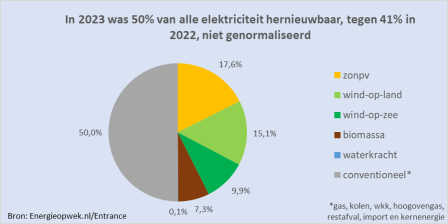

Le Pays-Bas ont longtemps été à la traine des pays européens concernant les énergies renouvelables. Sans doute pensaient-il que leurs vieux moulins à vent suffiraient. Surtout, le gisement de gaz de Groningue leur fournissait assez d'énergie bon marché pour ne pas avoir à chercher à en produire autrement. Depuis quelques années et surtout depuis que le gouvernement [est sommé de faire plus pour le climat](/le-gouvernement-doit-proteger-les-gens), la situation s'est retournée et les Pays-Bas font maintenant la course en tête. Selon, Energieopwek.nl, le site de statistiques de la platte-forme nationale sur le climat, l'année 2023 est l'année ou le pays a produit pour la première fois la moitié de son électricité à partir de source renouvelables. Cette part est en augmentation de 13% par rapport à 2022.

https://energieopwek.nl/

https://www.nationaalklimaatplatform.nl/nieuws12/2627274.aspx?t=2023-Hernieuwbaar-verder-gegroeid-Meerdere-doelen-gehaald

{.center}

Sur ce graphique, on découvre que 17% de l'électricité vient du soleil tandis que 25% vient du vent le reste des renouvelables vient la biomasse tandis que 0,1% de l'électricité est d'origine hydrolique. Les 50% restant sont les srouces restantes, notées *conventioneel* et regroupe, gaz, charbon déchets et l'énergie nucléaire qui n'est pas prise en compte comme renouvelable par la platte-forme pour le climat. En effet, même si l'électricité produite est décarbonnée, elle n'en utilise pas moins un minerai qui est n'est pas une ressouce infinie comme le vent et le soleil.

## En fait On n'est pas encore à 50%

En cherchant la répartition de ces énergies conventionelles pour connaitre la part de charbon, de combustibles fossiles et de nucléaire, je suis tombé sur un autre graphique produit par le site allemand [energy-charts.info](https://energy-charts.info/charts/energy/chart.htm?l=fr&c=NL&interval=year&year=2023&source=public). Ici point de pourcentage mais un diagramme en barres montrant les TWh produits par chaque source.

{.center}

Energy-charts classe les sources en trois catégorie, l'atomique, le renouvelable et le reste. On voit sur ce graphique que la partie renouvelable fait bien moins que la moitié du tout. Même en retirant la partie rose « autres », on reste loin des 50% de renouvelables.

Alors quel graphique croire… 

Les données de energy-charts.info viennent de ENTSO-E, le regroupement des entreprises européennes de transport d'électricité et sont données en TWh, c'est à dire en quantitée d'énergie cumulée sur l'année. La source du premier graphique vient des producteurs néerlandais eux mêmes, membres de la [platte-forme pour le climat](https://energieopwek.nl/#nationaal-klimaat-platform) et sont affichés en pourcentage et est présenté en pourcentage. Mais en pourcentage de quoi ?

Pour le comprendre on peut regarder les données des producteurs néerlandais traités par le bureau national des statistiques (CBS pour *Centraal Bureau voor de Statistiek*) qui dans sa dernière communication en octobre titrait *Bijna helft elektriciteitsproductie uit hernieuwbare bronnen* soit [presque la moitié de la production électrique d'origine renouvelable](https://www.cbs.nl/nl-nl/nieuws/2023/38/bijna-helft-elektriciteitsproductie-uit-hernieuwbare-bronnen). Cet article montre un graphique montrant la production trimestrielle d'`electricité par origine (nucléaire, fosile et renouvelable) et son évolution au cours des dernières années. La production totale est stable avec une petite variation saisonnière, la production délectricité d'origine renouvelable par contre est en augmentation constante depuis 2019, avec une accélération des deux denières années # Au bout du graphique (deuxième trimestre 2023) la courbe des énergies renouvelable est presque au milieu du tableau. Cela veut dire que pendant le deuxième trimestre 2023 production électrique d'origine renouvelable a presque (*bijna*) représenté la moitié de la consommation totale.

Cela veut dire que le 50% de renouvelables annoncé plus haut n'est pas un bilan de l'année (ce qui serait faux) mais une étape significatuve dans un processus où la part de renouvelables n'arrête pas d'augmenter. Pour que la production de l'année dépasse ces 50% il faudra sans doute attendre la fin de 2024.

Quelle augmentation !

La progression de la production d'électricité de source renouvelable a été trěs forte en 2023 grace  l'entrée en service de parc éoliens offshore qui sont entrées en service dernièrement. Le champ d'éoliennes de Borssele entrées en service en 2020 suivits par celui d'Hollandse Kust en 2023 avec une capacité de plus de 700 MW. Selon [la feuille de route](https://windopzee.nl/onderwerpen/wind-zee/viering-routekaart-2023/) de **vent en mer** (*wind op zee*) ] Les prochains parcs à entre en service seront la prochaine tranche de Hollandse Kust en 2026 puis un nouveau parc au large d'IJmuiden en Frise, prévu pour 2029-2030. La progression de 2024 devrait donc être un peu plus modérée que celle de 2023.

La deuxième source dénergie renouvelable est l'énergie solaire et là aussi la progression en 2023 est spéctaculaire. le CBS explique que cette augmentation de la part d'énergie solaire dans le mix électrique est dû au nombre croissant de panneaux photovoltaïques. Une tendance qui n'a pas l'air de s'arrêter. Le second graphique du CBS montre la progression de l'énergie solaire, éolienne, biomasse et hydrolique depuis 2015. On y voit que depuis 2015 environ, la production d'électricité d'origine solaire explose en été avant de se contracter quand les jours raccourcissent. On y voit aussi que l'énergie éolienne « prend le relais » en hiver puisque la courbe est presque lissée par l'augmentation de l'éolien en hiver, dûs aux vents plus forts mais aussi  l'ouverture de nouveaux parcs.. Ces deux dernières années, la production du nombre de panneaux solaires a même été plus rapide que celui des éoliennes provoquant un petit creux, une baisse de la production d'électricité d'origine renouvelable en hiver.
---
<!-- post notes:
https://www.entsoe.eu/about/inside-entsoe/objectives/ 
https://www.businessinsider.nl/40-procent-energie-hernieuwbaar-2022-zonnepanelen-windenergie/ 
carte des cables electriques vers les windfarms
https://windopzee.nl/publish/pages/225578/720px/woz_variant_windenergie-op-zee-met-netten-op-zee_v4_nl.jpg 
production d'éléctricité offshore file:///home/alix/Downloads/-digital-dutch-offshore-wind-market-report_21092023.pdf 

https://www.cbs.nl/nl-nl/nieuws/2023/38/bijna-helft-elektriciteitsproductie-uit-hernieuwbare-bronnen
--->
