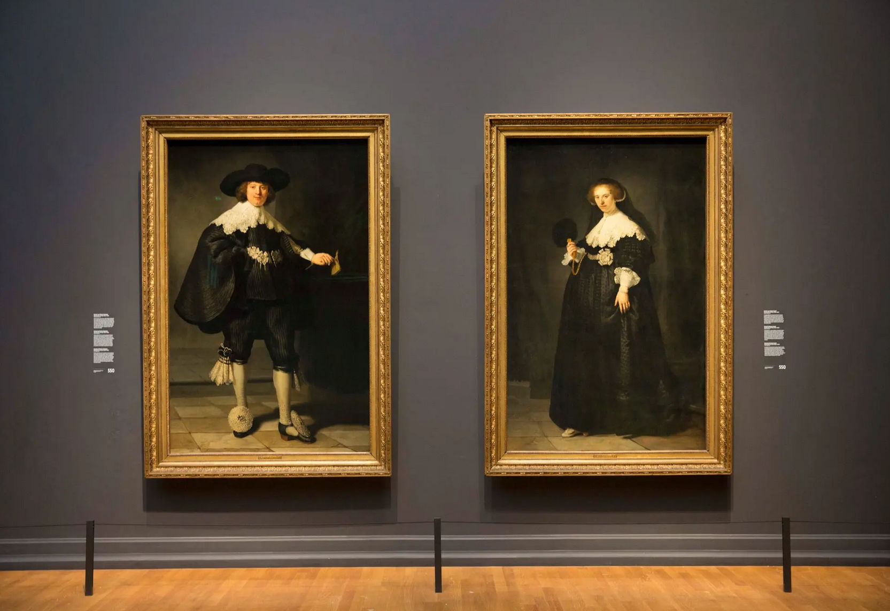
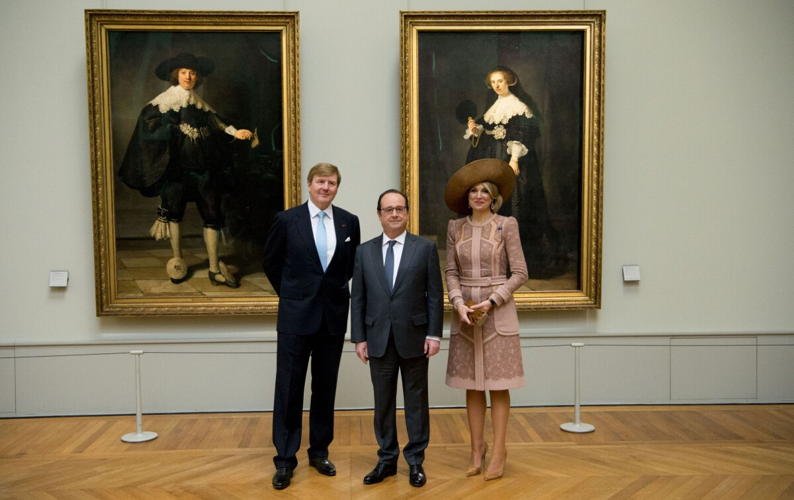
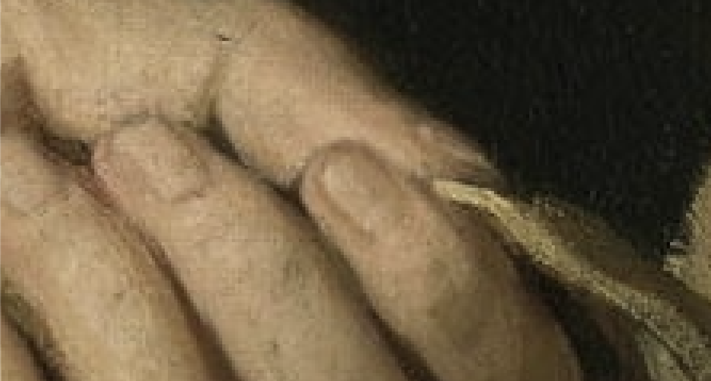
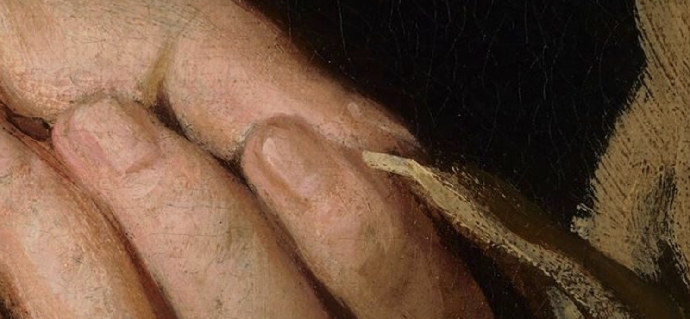

Les mariés de Rembrandt sont deux toiles peintes par le maître de l'école hollandaise Rembrandt van Rijn qui ne se quittent jamais. Les portraits en pied de Marten Soolmans et de son épouse Oopjen Coppit sont retournés au musée du Louvre [en ce 21 février 2024](https://presse.louvre.fr/les-portraits-de-marten-soolmans-et-doopjen-coppit-sont-de-retour/) après avoir passé un séjour au Rijksmuseum. Le musée parisien et celui d'Amsterdam s'échangent souvent les deux portraits en faisant attention de ne pas les séparer. Le musée du Louvre devrait les conserver pour cinq ans avant de les renvoyer dans la ville de Rembrandt.

Mais quel juge a prononcé une telle garde partagée de ces deux tableaux ?

<!--excerpt-->

## Les mariés de Rembrandt
Ces mariés sont, comme expliqué plus haut, deux portraits de Marten Soolmans et de son épouse Oopjen Coppit peints en 1634 par Rembrandt van Rijn. À cette date, Rembrandt était encore jeune mais déjà très productif. Il est possible que Oopjen Coppit ait commandé ces portraits pour aider un copain à se lancer… Toujours est-il que Rembrandt a réalisé là deux portraits uniques qui n'ont pas d'équivalent dans l'histoire du peintre puisqu'il n'a jamais plus réalisé de portraits grandeur nature comme ceux-ci pour le reste de sa carrière. C'est dire si ces mariés sont uniques.

{.center}

Ces toiles faisaient partie de la collection de la famille Rothschild depuis leur achat par le baron Gustave de Rothschild il y a plus d'un siècle. Eric de Rothschild les a mises en vente en 2015 pour la somme de 160 millions d'euros. Une broutille. Jamais aucun musée européen n'avait déboursé une telle somme pour une œuvre.

## Un accord à deux musées

L'idée est venue au musée du Louvre qui expose de nombreuses peintures de la collection des Rothschild et au Rijksmuseum qui expose de nombreuses œuvres de Rembrandt d'acquérir chacun une des deux toiles.

Comme les deux toiles n'ont jamais été séparées depuis que les époux les ont reçues du maître, les deux musées ont vite décidé de faire perdurer la tradition en partageant le temps qu'ils hébergeront les deux portraits ensemble. La décision a été prise conjointement en novembre 2015 et les vendeurs ont accepté l'offre conjointe le 9 décembre.

Il a ensuite fallu que les deux musées trouvassent chacun 80 millions d'euros, ce qui dépasse encore la plus grosse somme jamais déboursée pour une œuvre. En France, c'est grâce à un mécénat exceptionnel de la Banque de France que l'achat a pu être finalisé. Les Pays-Bas, plus pragmatiques, ont donné au musée national les moyens de sa politique d'achats.

## Le contrat des mariés

La vente a été scellée lors de [la signature d'un contrat](https://www.lequotidiendelart.com/articles/8606-accord-entre-la-france-et-les-pays-bas-pour-le-couple-de-rembrandt.html) intergouvernemental actant l'acquisition conjointe des deux toiles et l'intention des deux musées de ne pas séparer les toiles vivant ensemble depuis si longtemps. Le contrat a été signé le lundi 1ᵉʳ février 2016 par **Fleur Pellerin**, ministre de la Culture et de la Communication, et son homologue des Pays-Bas, **Jet Bussemaker**, ministre de l’Éducation, de la Culture et de la Science.

Le mois suivant, la vente étant consommée, les mariées commencèrent leur nouvelle vie commune face au public dans le plus grand Musée du monde, le Louvre. Le couple royal des Pays-Bas avait fait le déplacement pour l'occasion accompagné du directeur du Rijksmuseum.

{.center}

En 2018, Marten Soolmans et de son épouse Oopjen Coppit ont rafraîchi leur mariage. Les tableaux ont passé 18 mois dans les ateliers du Rijksmuseum pour restauration avant d'être à nouveau exposés ensemble dans le musée d'Amsterdam. Ce fut l'occasion pour France Inter de faire [une faute de frappe sur le nom du Rijksmuseum](https://www.radiofrance.fr/franceinter/podcasts/grand-angle/les-maries-de-rembrandt-restaures-1021719).

## Incertitude juridique

Fidèle à sa tradition de revendiquer les droits de tout ce qui passe en ses murs, le Louvre arbore un joli copyright **© 2016 RMN-Grand Palais (musée du Louvre) / Mathieu Rabeau** à coté de ses présentation des deux œuvres : [Portrait de Maerten Soolmans](https://collections.louvre.fr/en/ark:/53355/cl010249522) et [Portrait de Oopjen Coppit en costume à la française](https://collections.louvre.fr/en/ark:/53355/cl010249522). La photographie utilitaire à l'identique (quoiqu'un peu verdâtre à mon goût) d'un tableau, acquis avec l'argent public, suffi au musée français pour y mettre sa marque d'interdiction. Le site propose néanmoins de voir en plus grand certains détails choisis.

{.center}
> *détail de la main de Maerten Soolmans après avoir téléchargé un des détail choisis par le musée et coché la case pour accepter les termes et conditions*

Le Rijksmuseum de son côté, respecte mieux son public et propose en ligne des photos de [Marten Soolmans, Rembrandt van Rijn, 1634](https://www.rijksmuseum.nl/en/collection/SK-A-5033) et [Oopjen Coppit, Rembrandt van Rijn, 1634](https://www.rijksmuseum.nl/en/collection/SK-C-1768) aux tons bien plus chaleureux offrant la possibilité de zoomer sur n'importe quelle partie des tableaux. La notice de copyright indique logiquement
*Copyright: Public domain*.

{.center}
> ''détail de la main de Maerten Soolmans en zoomant directement sur la page web présentant le tableau (le zoom est au maximum mais l'image est un peu plus grande)*

Une autre différence réside dans la notice de propriété des œuvres. Le Rijksmuseum indique pour les deux tableaux *Joint acquisition by the Dutch State and the French Republic, collection Rijksmuseum/collection Musée du Louvre* ce qui correspond à l'histoire de cet achat présenté partout. Mais le site du Louvre présente le portrait de Maerten Soolmans comme la propriété du Rijksmuseum et celui d'Oopjen Coppit comme appartenant à l'État (français) accompagné de l'historique complète des propriétaires ce qui m'a aidé à écrire cet article. **L'acquisition des deux portraits a été faite par l’État français et l’État néerlandais : la France a acquis le portrait de Oopjen Coppit, grâce au mécénat exceptionnel de la Banque de France.** 

Le Rijksmuseum a fait par ailleurs, un travail formidable de mise à disposition d'une grande partie de son fond pour le public en proposant le [téléchargement haute définition](https://www.rijksmuseum.nl/nl/rijksstudio) via le *Rijksstudio* (identification requise). Ça serait trop bien que le Louvre fasse un partenariat avec le Rijksmuseum pour ce genre de choses aussi.

<!-- post notes:
source photo: https://static1.purepeople.com/articles/0/17/53/00/@/2127739-le-roi-willem-alexander-la-reine-maxima-1200x0-2.jpg
--->
