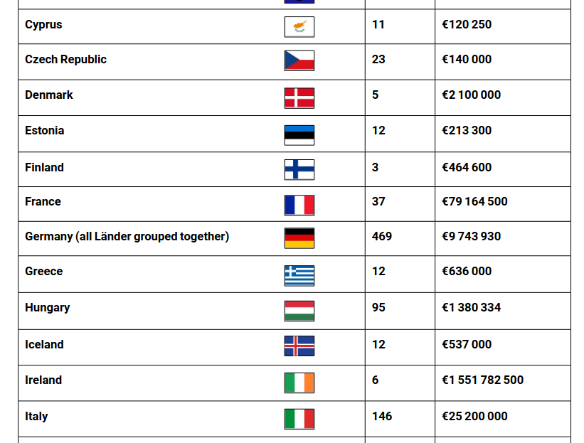

La CNIL vient de [l'annoncer](https://www.cnil.fr/fr/transferts-de-donnees-hors-ue-sanction-de-290-millions-deuros-lencontre-duber) : 

### Transferts de données hors UE : sanction de 290 millions d’euros à l’encontre d’UBER

Le géant mondial des taxis sans licence de taxi a écopé d'une forte amende pour non-respect du règlement européen sur les données personnelles. C'est la Ligue des Droits de l'homme et du citoyen en France qui a porté plainte de 170 chauffeurs de la plate-forme Uber auprès de la CNIL. La CNIL a ensuite transmis la plainte à l'autorité néerlandaise *Autoriteit persoonsgegevens* (ou APD en anglais) en vertu de la règle du guichet unique qui impose que l'affaire soit traitée par l'autorité de régulation des données personnelles du pays où réside l'organisation qui traite les données.

L'autorité annonce donc cette décision de l'AP du 22 juillet 2024 en expliquant le rôle de coopération qu'elle a tenu et le motif de l'amende : le non respect de l'article 44 relatif au transfert de données hors de l'Union européenne.

Le [communiqué](https://www.autoriteitpersoonsgegevens.nl/actueel/ap-legt-uber-boete-op-van-290-miljoen-euro-om-doorgifte-data-chauffeurs-naar-vs) de l'AP *AP legt Uber boete op van 290 miljoen euro om doorgifte data chauffeurs naar VS* donne plus de précisions. Entre 2020, année ou [la cour de justice de l'UE a invalidé](/cloud-merite-notre-confiance) le *Privacy Shield* qui (ne) protégeait (pas bien) les transferts de données entre l'UE et les États-Unis. Un nouveau cadre a été mis en place entre les deux coté de l'atlantique et Uber a commencé à utiliser ce cadre fin 2023. Seulement entre 2020 et 2023, les données personnelles des chauffeurs Uber ont continué à être envoyées aux États-Unis sans utiliser d'outils de transferts. L'autorité néerlandaise a donc jugé que la protection des données était insuffisante. Elle souligne que certaines de ces données étaient même des données sensibles comme des informations médicales.

La société Uber a annoncé faire appel de la décision en disant en gros qu'elle n'avait rien fait de mal.
<!--excerpt-->

### Les autres amendes d'Uber

La société Uber n'en est pas à sa première amende pour non-respect du RGPD. En 2018, elle a été condamnée pour avoir tenté de cacher une fuite des données personnelles de ses chauffeurs et clients. La loi oblige une organisation victime de fuite de données de le communiquer sous 72 heures à l'autorité des données personnelles, ce qui n'est pas facile à faire quand on veut cacher l'info. [source](https://www.autoriteitpersoonsgegevens.nl/actueel/ap-legt-uber-boete-op-voor-te-laat-melden-datalek "AP legt Uber boete op voor te laat melden datalek")

En décembre 2023, suite à la plainte de la Ligue des droits de l'homme et du citoyen, la société Uber avait déjà été condamnée à une amende de **10 millions d'euros** pour, cette fois, non-respect du droit d'accès. L'autorité avait jugé que la demande d'accès à ses données personnelles était inutilement compliquée et que les données envoyées étaient mal présentées. Elle a aussi constaté que les mentions légales sur le traitement de données personnelles (vous savez, ces pages très longues et chiantes que personnes ne lit) n'étaient pas complètes sur le site d'Uber. Pour cette amende aussi, la société a fait appel de la décision. [source](https://www.autoriteitpersoonsgegevens.nl/actueel/uber-krijgt-boete-van-10-miljoen-euro-voor-overtreden-privacyregels "Uber krijgt boete van 10 miljoen euro voor overtreden privacyregels")

### Une plainte française qui aboutit

Ce n'est pas le montant record que [la société Meta a été amenée à payer](https://www.dataprotection.ie/en/news-media/press-releases/Data-Protection-Commission-announces-conclusion-of-inquiry-into-Meta-Ireland) en Irlande en 2023 pour avoir, elle aussi, exporté ses données vers les États-Unis sans cadre sécurisé. C'est néanmoins une plainte française (*Klachten uit Frankrijk*) qui aboutit à une amende conséquente et ça mérite d'être souligné.

[Certaines mauvaises langues](https://firefish.imirhil.fr/notes/9xedov2rmdmr2pjk "Connaissant le total désintérêt de notre APD pour le sujet et la clôture sans sanction de centaines de plaintes sur le même thème") (ici je parle d'*aeris*, habitué des plaintes CNIL qui trainent) disent que c'est heureux que la décision ait été prononcée aux Pays-Bas. La CNIL, réputée plus laxiste, n'aurait peut-être pas condamné Uber.

Pourtant, rien que pour 2023, la CNIL a prononcé 42 sanctions, pour un montant de près de 90 millions d’euros. Elle ajoute même [au bilan de son action répressive](https://www.cnil.fr/fr/sanctions-et-mesures-correctrices-la-cnil-presente-le-bilan-2023-de-son-action-repressive "Sanctions et mesures correctrices : la CNIL présente le bilan 2023 de son action répressive"), 168 mises en demeure et 33 rappels aux obligations légales ont également été notifiés. Ce n'est pas rien.

C'est une année record et cela place la France dans le peloton de tête des autorités aux sanctions cumulées les plus fortes, devant les 9 millions d'euros d'amendes en Allemagne, mais derrière les 243 millions des Pays-Bas et le milliard infligé en Irlande.

{.center}

Les chiffres diffusés dans [le rapport annuel](https://www.edpb.europa.eu/our-work-tools/our-documents/annual-report/edpb-annual-report-2023_fr "EDPB Annual Report 2023") de l'organisme européen fédérant toutes les autorités nationales (EDBP) sont à prendre avec du recul. Ils ne traduisent pas forcément l'efficacité ou la sévérité de telle ou telle autorité nationale. Les chiffres élevés néerlandais et iIrlandais traduisent surtout la forte présence dans ces pays [facilitant la fraude fiscale|/Evasion-fiscale-aux-Pays-Bas|fr|Evasion fiscale aux Pays-Bas], de multinationales au chiffre d'affaires élevé. On peut même être tenté de penser que ceux qui font de l'optimisation fiscale sont aussi ceux qui tentent de contourner le plus le RGPD.

Mais pour en revenir à l'évaluation de la sévérité de la CNIL on peut regarder en détail le rapport annuel de l'EDPB qui explique que l'autorité française a prononcé 37 sanctions pour un montant de 79.164.500 €. Oui les chiffres sont différents sans que je puisse expliquer la différence. Par contre, l'EDPB liste les deux sanctions de 2023 les plus importantes, 5,2 milions d'euros d'amende pour **Clearview AI** pour ne s'être pas conformé à une décision de 2022 et 40 millions d'euros pour **CRITEO** pour absence de collecte du consentement, avec des plaintes venant d'ailleurs en Europe.

*aeris* souligne justement qu'il n'y a que dans le cadre européen que la CNIL sait se montrer sévère et c'est parce qu'avec le principe de guichet unique, les décisions, bien qu'instruites en France, sont suivies par d'autres autorités européennes, souvent à l'origine de la plainte. Une autorité nationale peut demander à une autre de revoir son jugement parce que ne protégeant pas assez les utilisateurs de son pays. La procédure est menée par l'EDPB et la CNIL doit revoir sa copie en prononçant une amende plus élevée.  C'est ce qui est arrivé en 2022 quand les autorités espagnole, polonaise, britannique ainsi que celles de Sarre et de Basse-Saxe ont contraint la CNIL de revoir à la hausse la sanction du groupe **Accord** pour non-respect de plusieurs règles du RGPD.

Avec 290 millions d’euros d'amende, la CNIL ne devrait pas avoir à utiliser la même procédure pour le cas Uber.

<!-- post notes:
Les sanctions sont calculées de la même manière dans toute l'Union avec un maximum de 4% du chiffre d'affaires global de l'entreprise sanctionnée. 
https://www.edpb.europa.eu/system/files/2024-04/edpb_annual_report_2023_en.pdf 

https://imirhil.fr/cnil/dipeeo-memoire_en_requete.pdf 
https://mast.eu.org/@aeris@firefish.imirhil.fr/113027687260488687
--->
