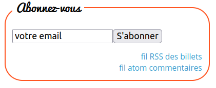
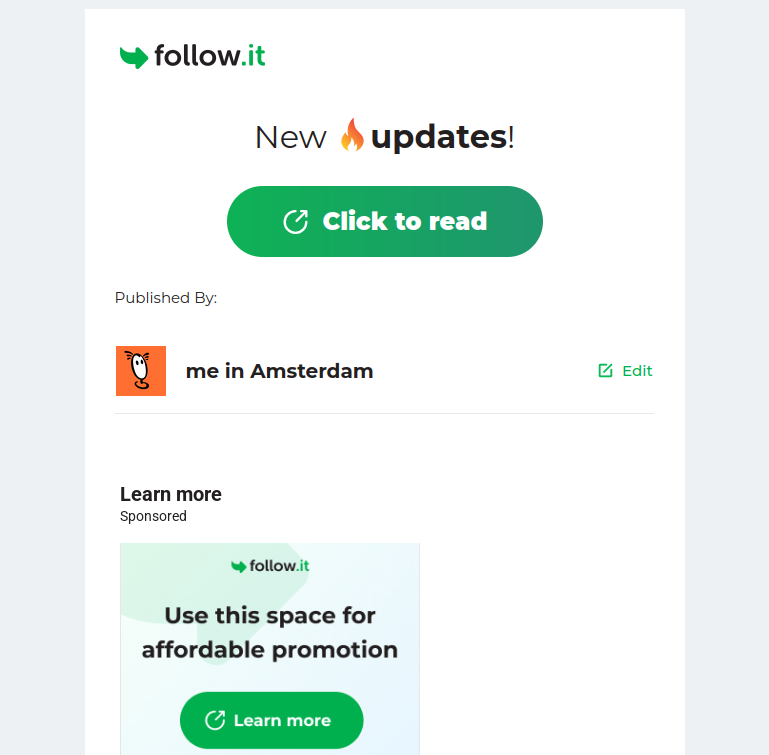

Depuis la création de ce blog il y a 18 ans, j'ai fait quelques mises à jour techniques pour améliorer ma façon de le gérer ou simplement l'habillage des pages. La dernière mise à jour technique date de cet été où je me suis littéralement débarrassé du moteur de blog Dotclear que j'utilisais depuis le début.

Maintenant, j'utilise un générateur de site statique qui s'appelle Eleventy. Pour épargner les détails techniques à mon lectorat non spécialisé, j'ai expliqué cette migration en détail [sur d'autres pages](https://alix.guillard.fr/notes/dotclear-to-eleventy/).

Ce faisant, j'ai dû faire quelques choix radicaux comme la suppression des commentaires. Rassurez-vous, les commentaires déjà écrits ont été conservés, mais il n'est plus possible d'en laisser de nouveaux. Si vous avez quelque chose à ajouter à l'un de mes articles, le plus simple est de [m'écrire à ce sujet](/contact/). 

Ce faisant, j'ai aussi supprimé la possibilité de suivre les commentaires auxquels quelques mails étaient abonnés. Je les ai donc ajoutés à la solution de newsletter que j'avais mise en place il y a quelque temps.

## Les services de newsletter

Tout blog qui se respecte offre un flux RSS ([le mien est ici](https://meinamsterdam.nl/feed.xml)) qui permet de **s'abonner aux nouveaux articles** d'un blog avec un logiciel dédié qu'on appelle un [agrégateur](https://fr.wikipedia.org/wiki/Agr%C3%A9gateur).

Avant 2021, j'offrais mon flux RSS au travers d'un service qui s'appelait FeedBurner. Ce service permettait aussi de recevoir les nouveaux articles par mail. C'est grâce à cela que j'ai commencé à offrir un service de newsletter.

{.center}

FeedBurner a été racheté par Google en 2007 qui l'a maintenu sans le modifier jusqu'en 2021. Après cela, Google a annoncé que le service allait changer pour une structure plus stable et moderne (comprenez *sera bientôt supprimé*) et que les personnes qui s'en servaient pour la newsletter devaient trouver une alternative au plus vite.

![Hi Alix,
FeedBurner has been a part of Google for almost 14 years, and we're 
making several upcoming changes to support the product's next chapter. 
Here’s what you can expect to change and what you can do now to ensure 
you're prepared.
Starting in July, we are transitioning FeedBurner onto a more stable, 
modern infrastructure. This will keep the product up and running for all 
users, but it also means that we will be turning down most non-core feed 
management features, including email subscriptions, at that time.
For those who use FeedBurner email subscriptions, we recommend 
downloading your email subscribers so that you can migrate to a new email subscription service.](google-feedburner.png){.center}

J'ai donc cherché un autre service qui envoyait des newsletters à partir du flux RSS et j'ai transféré les abonnements sur **Follow.it** qui semblait bien fonctionner. Mais très vite, le nouveau service a commencé à tronquer les mails pour forcer les personnes abonnées à lire la suite sur leur interface pas très bien faite, puis à rajouter des pubs dans les mails si bien qu'à la fin, ça ne resemblait plus à une newsletter.

{.center}

Il fallait donc que j'arrête d'utiliser ce service. J'ai pensé utiliser un service comme Substack, Brevo ou Kessel pour partager mes contenu mais c'était à nouveau m'appuyer sur un service qui pouvait se transformer au moment où je m'y attends le moins.

## Mon service de newsletter

Après moult hésitations, je me suis décidé à gérer moi même l'envoi des nouveaux articles par mail. J'ai installé [Listmonk](https://listmonk.app/), un logiciel complet de newsletter qui ne fera que ce que je lui demande et ne s'arrêtera que si je le décide.

J'y ai ajouté les adresses mail abonnées à ma newsletter sur mon ancien service et j'ai mis à jour mon [formulaire de souscription](https://meinamsterdam.nl/newsletter/).

Ensuite, et suite aux changement du site concernant les commentaires, je viens d'abonner aussi toutes les personnes qui suivaient les commentaires de mon blog sans en recevoir depuis de nombreux mois.

Si vous êtes surpris de trouver cet article dans votre boîte aux lettres, en voici toute l'explication.  Il est possible que ce choix ne vous convienne plus. Dans ce cas le lien de d'abonnement en bas de page est pour vous. Pour tous les autres, bienvenue, welkom.