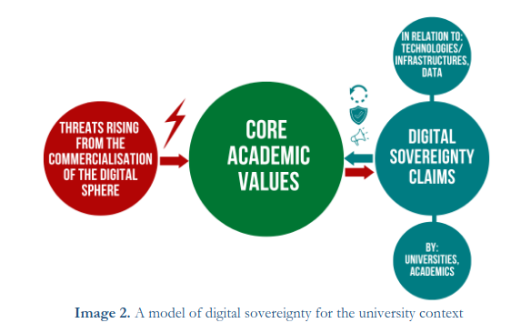

C'est sur [un blog furtif](https://grenoble.ninja/) que j'ai appris la nouvelle. Il y a des profs d'université qui sont inquiets de la manière dont leur université d'Utrecht traite les données de ses étudiants et personnels. La dépendence aux services de cloud de grandes entreprises étasuniennes (en particulier Microsoft, Google et Amazon) est de plus en plus grande et rien n'est fait pour offrir une alternative locale à ces services.

### Un problème connu

En 2022, le *Nationaal Cyber Security Centrum (NCSC)* avait publié une étude juridique montrant que l'utilisation de services américains pour gérer les données personnelles européennes n'était pas compatible avec le droit européen. L'avis avait même été [confirmé par la cour de justice européenne](/cloud-merite-notre-confiance/).

<!--excerpt-->

Les recteurs d'université avaient tiré la sonnette d'alarme dès 2019. Dans [une tribune publié dans le Volkskrant](https://www.volkskrant.nl/columns-opinie/digitalisering-bedreigt-onze-universiteit-het-is-tijd-om-een-grens-te-trekken~bff87dc9/), ils déploraient déjà le recours croissant en ces services du cloud qui enferment les universités et leurs membres dans des prisons numériques.

On peut même citer deux publications universitaires qui détaillent le problème. La première en 2023 [sur la transformation numérique](https://www.ivir.nl/projects/information-law-and-the-digital-transformation-of-the-university/) de l'Institut du droit de l'Information de l'Université d'Amsterdam (The Institute for Information Law  ou *IViR*), dont la première partie traite de la souveraineté numérique. La seconde en 2024 est l'[article d'un étudiant](https://communities.surf.nl/files/Artikel/download/Safeguarding_Dutch_Universities_Against_Big_Tech_Dominance_0.pdf) de l'Universitè Radboud de Nimègue qui explique comment protèger les universités néerlandaises de la dominance des *Big Tech*.

{.center}

### La lettre ouverte

Depuis, rien n'a changé. La numérisation des services a même fait empirer la dépendance des universités qui ont continuer de laisser tomber les services gérés en interne. C'est pour cela qu'**Albert Meijer** et **José van Dijck**, deux profs de l'Université d'Utrecht ont lancé une lettre ouverte au conseil d'administration de leur université.

Dans cette lettre, ils décrivent la situation actuelle et les risques encourus. Ils demandent un changement de cap pour renforcer l'autonomie et la flexibilité des universités au niveau des services et de conserver un savoir faire au niveau national. Je ne détaillerais pas leur propositions qui sont déjà traduites en français et publiées par Nicolas Vivant [sur son blog furtif](https://grenoble.ninja/utrecht-university/).

Ce que la traduction ne dit pas c'est que cette lettre, très claire, est inspiré d'une pétition demandant la même chose à l'Université Radboud de Nimègue. Ensuite, d'autres universitées se sont jointes à la pétition. On peut retrouver en ligne celle d'[Eindoven](https://research.tue.nl/nl/publications/open-brief-over-digitale-autonomie-van-nederlandse-universiteiten) ou de [Groningue](https://research.rug.nl/en/publications/open-brief-over-digitale-autonomie-van-nederlandse-universiteiten) sur le site de ces universités. La lettre de Meijer et van Dijck est partie pour être envoyée à tous les conseils d'administration de toutes les universités du pays.

> Betrokken wetenschappers van elk van de Nederlandse universiteiten
> - Erasmus Universiteit Rotterdam – Moniek Buijzen
> - Maastricht University – Sally Wyatt
> - Open Universiteit – Reijer Passchier
> - Radboud Universiteit Nijmegen – Jaap-Henk Hoepman
> - Rijksuniversiteit Groningen – Oskar Gstrein
> - Tilburg University – Corien Prins
> - TU Delft – Seda Gürses en Martijn Warnier
> - TU Eindhoven – Sjoerd Romme
> - Universiteit Amsterdam – Claes de Vreese en Natali Helberger
> - Universiteit Leiden – Bram Klievink
> - Universiteit Twente – Rene Torenvlied en Roland van Rijswijk-Deij
> - Vrije Universiteit Amsterdam – Bart van den Hooff en Marleen Huysman
> - Wageningen University – Dave Huitema en Cees Leeuwis

### Les retombées de cette lettre

Après la cloture des signatures le 16 avril, la pétition a été remise officiellement aux dirigeants de l'Université d'Utrecht le 25 mai 2025 [devant la presse](https://dub.uu.nl/nl/nieuws/open-brief-over-big-tech-aangeboden-aan-het-uu-bestuur), accompagnée des 475 signatures.

La présidente du conseil d'administration de l'Université d'Utrecht a envoyé une réponse très positive pendant l'été où elle reconnait la préoccupation des signataires et les valeurs universitaires qui sont mises en avant. Elle rappelle les engagements de l'Université pour ces valeurs et ces engagements passés. Elle précise tout de même, que le changement de cap souhaité demandera beaucoup d'efforts et de préparation. ([lire la réponse en anglais ici](https://www.uu.nl/sites/default/files/Response%20to%20Open%20Letter%20Advancing%20Digital%20Autonomy%20at%20Utrecht%20University%20%281%29.pdf))

Comme on ne bouge pas un mamouth aussi rapidement, il reste encore à attendre pour savoir si cette lettre ouverte va réellement faire changer les choses. Mais nul doute que Meijer et van Dijck resteront vigilants.

<!-- 
in https://pure.tue.nl/ws/portalfiles/portal/359938550/Brief-digitale-autonomie_Mei-2025_final.pdf
 -->