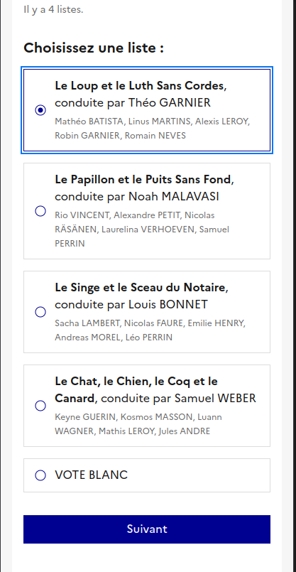
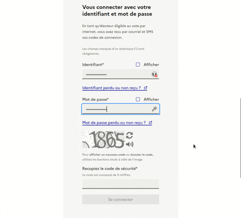
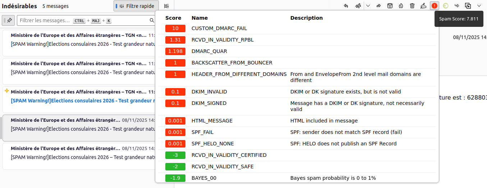

Les Français résidant hors de France vont à nouveau retourner aux urnes en 2026 pour élire leurs conseillers consulaires, élection que j'ai déjà couverte [en 2014](/Les-nouveaux-conseillers-consulaires/) et [en 2022](/Les-nouveaux-conseillers-des-francais-des-Pays-Bas/) en expliquant le rôle (plutôt limité) de ces élus.

En 2026 l'option de voter par Internet va à nouveau être présentée comme une option de vote avec le vote à l'urne qui obligera les électeurs à se rendre un jour précis dans un lieu où des citoyens volontaires gèrent les bureaux de vote.

## Un test pas si en grand et pas si nature

La mise en place du vote par internet pour l'ensemble des inscrits dans le monde entier pour des centaines de scrutins est une opération de grande envergure et pour ne pas se rater, l'administration organise avec le prestataire qui a développé la solution de vote, un **test grandeur nature**, simulant une élection fictive pour des centaines d'électeurs volontaires. Pendant cette semaine de vote, les équipes du MEAE et ses prestataires s'assurent du bon fonctionnement complet de la solution.

#### Tester la résistance des serveurs

Pour effectuer un test de charge des serveurs, une centaine de volontaires ne peut pas reproduire les millions des milliers d'inscrits lors d'une élection véritable. Je pense donc que ces tests de charges sont réalisés par des outils spécifiques qui permettent aussi de mesurer la résistance aux attaques extérieures comme les attaques DDoS.

#### Tester l'efficacité de la solution dans le monde entier

La multiplication des volontaires permet surtout de produire une multiplicité des configurations que la solution doit prendre en compte tant pour la connexion que pour l'envoi des messages mail et SMS sur les différents réseaux de nombreux pays. 

Hélas la grandeur de cet échantillon de votants est ici aussi trop petit pour faire apparaitre des problèmes qui pourrait apparaitre dans le cas d'envoi de message plus nombreux. Ainsi, en 2022, des problèmes de refus d'acheminement de mails et de SMS perdus sont apparus durant le scrutin officiel alors qu'ils ne se sont pas produits durant le test grandeur nature.

#### Tester la réception de la solution par le public

Enfin, le test grandeur nature permet de recuillir le retour d'utilisateurs en amont de la mise en place de la solution ce qui permet d'ajuster les messages et les interfaces pour rendre l'utilisation de la solution la plus accessible possible.

Normalement ce genre de test est réalisé par des équipes spéciales de testeurs et d'ingénieurs qualité qui peuvent rendre un audit ou une liste de fonctionalités à mettre à jour. 

Je pense d'ailleur que le perstataire ne coompte pas sur ce test grandeur nature pour améliorer la qualité de sa solution puisqu'aucun formulaire de retour ou adresse de contact n'est fournie aux volontaires. C'est d'ailleurs bien dommage parce que sur [les 13 pages de remarques](/teste-le-vote-Internet/) que j'ai envoyé après avoir fait le teste grandeur nature de 2022, seules deux ou trois améliorations avaient été implémentées dans le système. 

## La solution de 2026

Pour les élections de 2026, le système en place ressemble beaucoup à ce que j'avait déjà utilisé en 2022. Le prestataire, auteur de la solution est d'ailleurs Voxaly-Docaposte, le même que pour la solution de 2022. Néamoins, le MEAE, ayant tiré les ensignements des ratés durant les élections de 2022 a fait évoluer son cahier des charges.

En 2022 certains électeurs ne recevaient plus leur code de confirmation par mail rendant l'autentification impossible. Certain fournisseur de mail comme Yahoo ou Verizon avaient tout bonnement bloqué le système de vote pour SPAM. Je suppose que le cahier des charge impose à la solution d'utiliser toutes les ficelles des ~~spameurs~~ sociétés de marketing en ligne pour éviter que cela se reproduise. 

#### France Identité

De plus elle a demandé la mise en place de l'autentification par France Identité, une application mobile régalienne d'authentification en ligne qui permet de certifier son identité nationale.

Cette nouvelle option est très judicieuse car elle permet d'éviter de reposer sur des prestataires étrangers d'accès à internet et d'abonnement au téléphone pour certifier l'identité des électeurs.

France Identité commence à être largement adopté en France parce que certaines personnes s'en servent pour prouver leur réservation de TGV ou retirer un colis à la poste. Hélas, il y a peu de cas d'usage hors de France (à vrai dire cette élection par Internet est le premier cas que je connaisse). De plus l'ouverture d'un compte France Identité doit être validée par le passage d'un facteur de la Poste qui n'est pas possible hors de France ou par un compte France Connect qui, depuis de nombreuses années déjà n'est pas accessible à tous les français résident hors de France.

Comme nombre de projets de numérisation des services publics, la simplification offerte par France Identité est semmée d'embuches.

#### Ce qui ne change pas

Dans mon rapport de 13 pages rédigé suite à mon test de 2022, j'avais plusieurs remarques sur l'ergonomie, le choix des termes pour améliorer le sentiment de sécurité de las solution de vote et quelques remarques techniques comme des pages manquantes et des certificats manquants.

J'avais aussi suggéré de réduire le risque de coercition du vote en permettant aux électeur de mettre à jour leur vote même après l'avoir validé.

<!-- TODO: + ouverture du code ? -->

La plupart de ces remarques sont encore valides aujourd'hui. Si l'application a changé certaines configurations ou contrôles demeurent imparfaits.

Ainsi, je mail appellant au vote contennait deux liens vers des pages d'aide qui n'existent pas (Erreur 404), l'identifiant de connexion qu'il faut recopier sans erreur est toujours offusqué par defaut et le certificat du site web n'a toujours pas de propriétaire explicite.

#### Une présentation des bulletins améliorée

En 2022, je signalais l'horreur de présenter les bulletins sur deux colonnes même sur un petit écran de téléphone ce qui rendait le nom des listes parfois impossible à lire en entier.

En novembre 2025 le teste me montre des bulletins sur une seule colonne ou le nom de la liste, nême très long, s'affiche sur l'écran en entier. Un grand progrès pour ceux qui vont voter depuis leur mobile.

#### mais pas complètement

Seulement la liste des bulletins souffre d'un autre problème d'accessibilité. Les personnes ne pouvant utiliser la souris, utilisent leur clavier. Elles naviguent entre les éléments activables d'une page avec la touche *tabulation* et cliquent avec la touche *entrée*. Or la sur la page des bulletin, seul le premier bulletin est activable via la touche *tabulation*. Il est donc impossible pour les personnes sans souris de choisir un autre candidat.

Cette erreur est cruciale à corriger parce que les administrations sont légalement contraintes de proposer des sites et des applications accessibles mais en plus de ça, cela crée une ruptire d'égalité devant le vote en excluant *de facto* certains electeurs de cette modalité de vote.

#### Ce qui est nouveau et peut-être plus grave

Dans mon raport de 2022, j'avais constaté que tous les mails, (envoi d'identifiant, annonce d'ouverture du vote, code de confirmation…) n'étaient pas tous envoyés par la même adresse ce qui n'aidait pas à identifier les courriers autentiques d'éventuels spams et courriers d'hameçonnage administratifs que nous recevons tous.

Cette erreur a été corrigée. Tous les mails sont envoyés par `Ministère de l'Europe et des Affaires étrangères <voteinternet@votezaletranger.gouv.fr>` ou `Ministère de l'Europe et des Affaires étrangères <noreply@votezaletranger.gouv.fr>`. 

> Attention, la suite est un peu technique

Seulement, le diable se cachant dans les détails, j'ai remarqué que les mails envoyées par l'application (identifiant, mise à jour du mot de passe et code de confirmation…) étaient toujours identifié comme spam par mon gestionaire de mails. En essayant de savoir pourquoi, j'ai constaté que cette classification était due à un [Echec DMARC](https://fr.wikipedia.org/wiki/DMARC).

DMARC est une politique de traitement des mails après vérification d'informations fournies par le serveur du nom de domaine de l'expéditeur du mail. par exemple, le code de confirmation de vote est envoye par le serveur `o3.p25.mailjet.com [185.189.236.3]` mais l'expéditeur est `noreply@votezaletranger.gouv.fr`. Pour vérifier que l'expéditeur est légitime, qu'il est bien le `noreply@votezaletranger.gouv.fr` qu'il prétend être, le serveur de mail du destinataire va envoyer une requète au serveur du nom de domaine `votezaletranger.gouv.fr` pour savoir si `o3.p25.mailjet.com` ou `185.189.236.3` est bien habilité à envoyer des courriers à ce nom. Il peut aussi envoyer une requète pour vérifier une éventuelle signature cryptographique envoyée dans l'entête du message.

Si aucune de ces vérifications n'est valide, il y a de fortes chances que l'adresse de l'expediteur soit usurpée et que le courrier soit un spam. Une autre possibilité est que l'utilitaire d'envoi de mail soit mal configuré. C'est dans ce dernier cas que nous nous trouvons mais le serveur de mail qui ne peut pas s'en rendre compte étiquète cet envoi comme spam.

Le mail d'annonce de l'ouverture du vote est envoyé par un autre prestataire étranger `i2.ms203.atmailsvr.net [91.199.29.203]` mais la signature cryptographique dans l'entête du domaine est validée lors de la requète au serveur de nom de `votezaletranger.gouv.fr`. Le courrier n'est donc pas étiqueté spam parce qu'il est légitime. 

Le courrier envoye avec `voteinternet@votezaletranger.gouv.fr` alors que l'envoi n'est pas parti du MEAE. Seulement l'outil d'envoi des mails chez Active Trail (c'est le nom du prestataire du `91.199.29.203`) a bien été configuré.

Il suffirait donc que l'outil d'envoi des mails avec `noreply@votezaletranger.gouv.fr`, qui est hébergé par mailjet, soit, lui aussi configuré correctement. Mailjet, entreprise américaine spécialisé dans le ~~spam~~ marketing digital, fourni même [un guide complet](https://documentation.mailjet.com/hc/fr/articles/360049641733-Guide-complet-d-authentification-des-domaines-avec-SPF-et-DKIM) pour aider à la configuration de ses outils. Suivre ce guide (et bien configurer la zone `votezaletranger.gouv.fr`) est la meilleure garantie pour que les courriers d'envoi des identifiants aux électeurs ne soient pas à nouveau bloqués.

> Attention, la suite est un peu politique

Le Ministère de l'Europe et des Affaires étrangères français a confié à une entreprise française **Voxaly-Docaposte**, le soin de gérer la solution de vote par Internet. Cela me permet de penser que les données personnelles que j'ai confiées à mon consulat pour pouvoir exercer mon droit de vote, ne quitteraient pas le territoire français. 

En grattant un peu les données techniques dans les entêtes des courriers que j'ai reçu, je constate que ces données sont passées par [un serveur en Israel](https://apps.db.ripe.net/db-web-ui/query?from=www&searchtext=91.199.29.203) et un autre est parti depuis la filiale française ([Mailjet SAS](https://apps.db.ripe.net/db-web-ui/query?bflag=false&dflag=false&rflag=true&searchtext=185.189.236.3&source=RIPE)) d'une société américaine.

Ces deux entreprises indiquent bien respecter le RGPD — ce qui est la moindre des choses dans leur métier — mais je ne suis pas certain que mes données ne tombent pas sous le coup d'un loi extra-territoriale qui obligerait ces sociétés à déroger au RGPD suite à une requète judiciaire à leur siège. Pour le cas de la société américaine on sait depuis la jurisprudence *Schrems II* que c'est un risque à envisager. Ce risque qui a été [confirmé aux Pays-Bas](/cloud-merite-notre-confiance/) en 2022.

En participant au test grandeur nature du vote par Internet, je pensais découvrir des avancées pour améliorer le sentiment de confiance des électeurs mais j'ai surtout vu qu'il y a encore du travail.

{#  https://www.senat.fr/questions/base/2025/qSEQ250605046.html #}