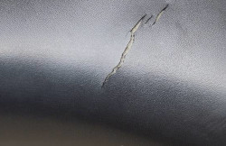

je l'ai fait [pour mon Btwin](/revision-du-btwin/) après un an à dormir dehors à Amsterdam, je fais le point sur les petits bobos de mon vélo Que je vous ai présenté ici à [plusieurs reprises](/tag/drooderfiets/). Après avoir parcouru des kilometres en Europe, il ne va pas très bien. Les vitesses n'arrêtent pas de sauter et en plus Un frein vient de casser. V'est le pompon ! Mais ce n'est pas tout.

{.left}
Je vanatis les vélos hollandais parce qu'ils avaient un carter, cette pièce de protection en plastique permet de faire du vélo sans remonter son pantalon et protège la chaine contre l'usure des entemperies. Seulement rien ne protège le carter contre l'usure des intempéries et ici, on voit qu'il commence à rouiller.

{.left}
En plus il y a quelques bouts du carter qui sont cassés. Pas de gros bouts mais quand même… Celui-ci fait apparaitre un peu la chaine à l'arrière. Oui la chaine déjà été changée et le réparateur en a mis une rose. Une fantaisie qui ne peut plu sêtre cachée.

{.left}
Le moyeux de vitesse, à l'arrière n'arrête pas de sauter. Il a pourtant été nettoyé l'année dernière. La dynamo à l'avant est le seul moyeux qui fonctionne correctement. Par contre le phare n'éclairait plus, il a fallu le changer. Le réparateur m'en a choisit un chromé ce qui est une fantaisie de plus.

{.left}
La lampe arrière, elle, fonctionne bien. Il faut dire que c'est la quatrième fois que je la change. Avec la mode des mini lampes diodes, il est de plus en plus difficile d'en trouver. Sur cette photo on peut voir le porte bagages qui a lui aussi bien travaillé, les bords sont usés et rouillés.

{.left}
Le garde boue avant n'est pas trop rouillé mais il a quand même des éclats de peinture. Et puis il est un peu déformé par les coups. La bavette n'arrive plus à être bien allignée avec le bord mais elle continue à remplir son rôle.

{.left}
Le garde boue arrière n'est pas en meilleur état mais les marques du magasin (de zwaartefietsplan) et du fabriquant (Azor) tiennent bien dans le temps elles. À par quelques petits coups elles restent bien lisibles. 

{.left}
Les jupes de Drooder sont encore là des deux cotés mais on voit qu'elles ont vécu. Jaunies par le soleil, cassées en divers endroits par les coups ou les chutes. Je ne sais pas si cela vaut le coup de les garder.

{.left}
J'ai jamais trouvé cette selle terrible mais je l'ai pourtant gardée 16 ans. Maintenant elle est fendue et quand il a plu, mes fesses sont mouillées. Changer la selle ne serait pas du luxe.

{.left}
Le pneu arrière est comme qui dirait usé jusqu'à la corde ! C'est peut-être le troisième pneu arrière mais le changer à nouveau ne serait pas du luxe non plus.