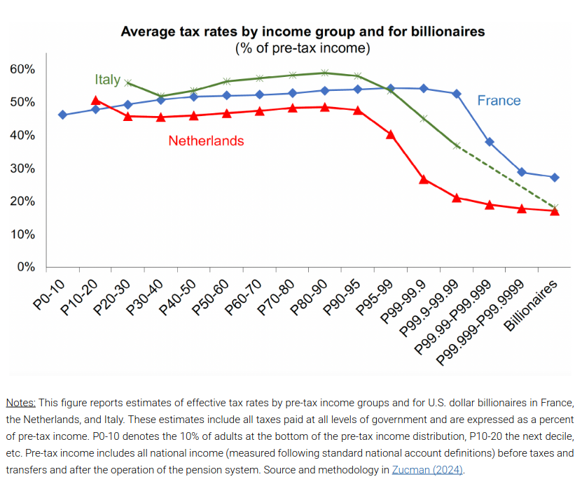
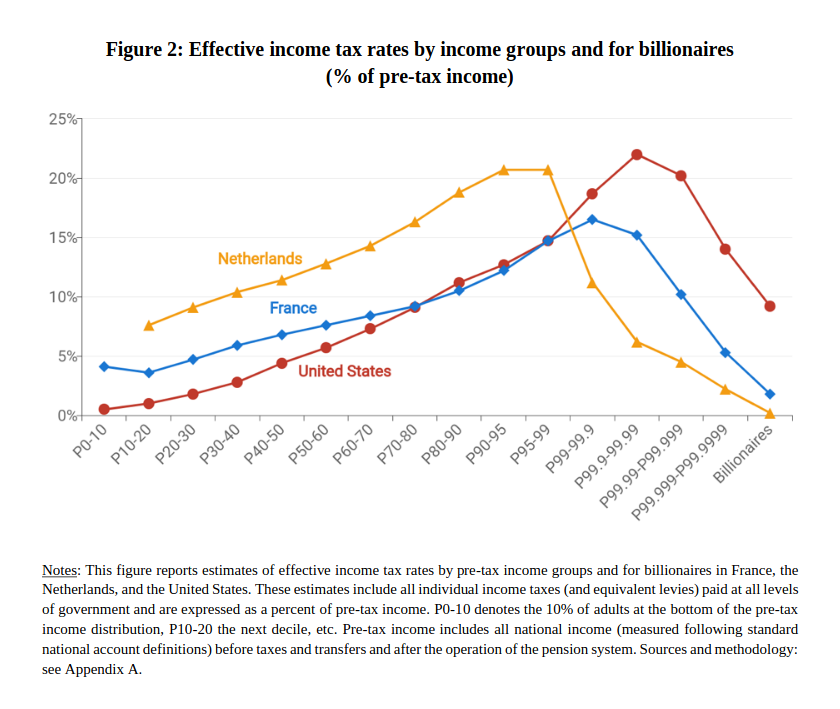

Non, la taxe « Zucman » n'existe pas aux Pays-Bas. Mon titre accrocheur vient du débat actuel autour de cette proposition de mesure fiscale qui attise les passions, surtout celle des miliardaires. C'est justement un miliardaire qui me fait réagir aujourd'hui. [Selon lui](https://www.france24.com/fr/info-en-continu/20250920-bernard-arnault-sonne-la-charge-contre-la-taxe-zucman), la taxe Zucman relève « d'une volonté clairement formulée de mettre à terre l'économie française ». Rien que ça. Les Pays-Bas auraient donc tout faux me dis-je ?

## L'impôt sur la fortune

L’impôt sur la fortune est un impôt individuel appliqué non pas sur un revenu ou une transaction, mais sur le patrimoine, en fonction de la valeur de tout ou partie de ce patrimoine. 

L'impôt sur la fortune a été supprimé en France et remplacé en 2018 par un [impôt sur la fortune immobilière](Impôt sur la fortune immobilière) taxant les propriétaires d'un patrimoine immobilier au dessus d'un certain seuil. 

Au Pays-Bas aussi l'impôt sur la fortune a été supprimé. C'était en 2001 et il a été remplacé par un impôt sur le patrimoine en fonction de sa valeur de rendement estimée.

## L'impôt sur le patrimoine

Les contribuables néerlandais doivent déclarer leur patrimoine. Bien immobiliers, épargne, comptes bancaires, cryptos et autres investissements dans [la case 3](https://www.belastingdienst.nl/wps/wcm/connect/nl/box-3/box-3) de leur déclaration de revenus. 

En fonction de son estimation et au delà de 57.000 €, l'administration en déduit un rendement fictif (*fictief rendement*) qui dépend du type d'actif et varie tous les ans. et impose cette somme à hauteur de 36%.

#### Tableau de taux de rendement fictifs établis par l'administration fiscale

|               | 2024 | 2023 | 2022 | 2021 |
|---------------|------|------|------|------|
| épargne       |   1,44%   |  0,92%    |  0,00%    |  0,01%    |
| autres actifs |   6,04%   |  6,17%    |  5,53%    |  5,69%    |
| dette         |   2,61%   |  2,46%    |  2,28%    |  2,46%    |

source: [Hoe wordt mijn box 3-inkomen berekend met het fictief rendement?](https://www.belastingdienst.nl/wps/wcm/connect/nl/box-3/content/berekening-box-3-inkomen-fictief-rendement){.center}

Un rapide calcul permet de voir qu'en somme, le patrimoine —hors épargne— des contribuables néerlandais est taxé autour d'un peu plus de 2%. C'est il me semble, un des taux proposé pour la fameuse taxe Zucman, sauf qu'ici l'assiette est bien plus large.

En revanche, les revenus réels de ce patrimoine, intérets, loyers et plus-values sont exonérés d'impôt ce qui est une niche fiscale bien connue aux Pays-Bas.

[Il semblerait](https://www.belastingdienst.nl/wps/wcm/connect/nl/box-3/content/berekening-box-3-inkomen-fictief-rendement) que maintenant, si le rendement réel des actifs est inférieur aux estimations du rendement fictif, il soit possible de demander à être imposé sur le rendement effectif (*werkelijk rendement*) et donc demander le remboursement du trop perçu.

## L'effet sur l'économie

Évidemment la comparaison entre la taxe Zucman et la *Box 3* reste limité puisque les deux dispositifs sont différents par leur assiette, leur présentation et que le cadre fiscal en France et aux Pays-Bas sont différents. Mais leurs similitudes, nottement le taux permet de regarder aux Pays-Bas quelles pourraient avoir les effets de cette taxe en France.

L'idée néerlandaise de ce mode d'imposition est justement de stimuler l'économie en évitant les actifs dormants et en ne pénalisant pas les actifs aux rendements exceptionels.

En effet, le riche particulier, sachant qu'une forte somme sur son compte courant sera taxé aura intéret à le placer pour que cet impôt soit effectivement payé sur les intérets générés. De même. un héritage foncier ne devrait pas rester inutilisé longtemps si son nouveau propriétaire doit régulièrement payer un impôt sur ce qu'il pourrait rapporter. 

Depuis 25 ans qu'il est en place cet impôt néerlandais sur le patrimoine n'a pas fait parler de lui comme un dispositif capable de mettre à terre l'économie du pays, mais plutôt pour le contraire. La plupart des gens qui m'ont exposé cette *Box 3* m'ont aussi parlé de cette obligation intrinsèque de faire travailler ses actifs puisque l'administration fiscale (*Belastingdienst*) en estime les revenus.

## L'effet sur les grandes fortunes

J'ai eu envie de voir aussi si cet impôt sur le patrimoine néerlandais avait un effet sur le taux d'imposition des plus riches aux Pays-Bas. Après tout, c'est parce que les plus riches payent moins d'impôts sur le revenu que les classes moyennes que la taxe Zucman a été imaginée.

Dans [son travail](https://gabriel-zucman.eu/files/report-g20.pdf) pour la mise en place de la taxe qui porte son nom, Gabriel Zucman cite justement les Pays-Bas en citant et s'appuyant sur les travaux d'Arjan Bruil du Bureau Central des Statistiques (*Centraal Bureau voor de Statistiek* CBS).

 

{# Actual return ('werkelijk rendement'): the return you really had on your assets.

Notional return ('fictief rendement'): the return we calculate using fixed percentages #}

<!-- 

taxe Zucman
https://gabriel-zucman.eu/files/report-g20.pdf

https://www.taxobservatory.eu/www-site/uploads/2025/03/Resources-for-a-Safe-and-Resilient-Europe_The-Case-for-Minimum-Taxation-of-Ultra-High-Net-Worth-Individuals-in-the-EU-1.pdf

etudes NL
https://research.tilburguniversity.edu/en/publications/inequality-and-redistribution-in-the-netherlands
https://www.cpb.nl/system/files/cpbmedia/omnidownload/CPB-Discussion-Paper-436-Inequality-and-Redistribution-in-the-Netherlands.pdf

débats

https://lejournal.kessel.media/posts/pst_ec919fcde1df48fb9ba73d992433db25/ledito-pauvres-milliardaires

https://matt.kessel.media/posts/pst_f6c5ea5b33cf4f3189d3e7fd5bf9ec39/lidee-nest-plus-de-savoir-si-mais-quand

impots au PB
https://www.touteleurope.eu/economie-et-social/comparatif-impot-sur-la-fortune-dans-quels-pays-europeens-est-il-applique/
https://www.touteleurope.eu/economie-et-social/impot-sur-les-plus-riches-la-taxe-zucman-existe-t-elle-dans-les-pays-europeens/
https://www.expat.com/fr/guide/europe/pays-bas/11117-impots-aux-pays-bas.html#impots-fonciers-aux-pays-bas-6 
https://finance-xpat.com/fr/declaration-dimpots-pays-bas/
https://www.francaisdespaysbas.nl/archives/9990

pays-bas Box 3 
https://www.belastingdienst.nl/wps/wcm/connect/nl/box-3/box-3
https://www.belastingdienst.nl/wps/wcm/connect/nl/box-3/content/wat-is-mijn-werkelijk-rendement

-->