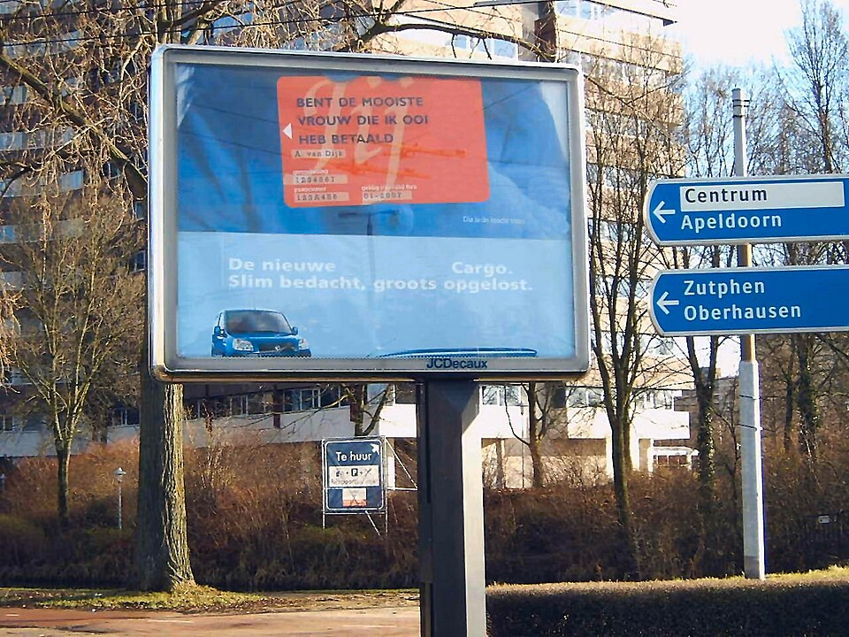
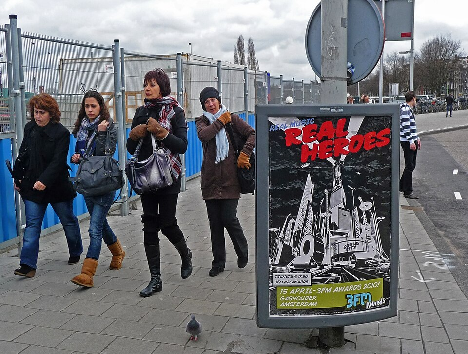

*Amsterdam met fin aux vacances en avion*. Ce n'est pas moi qui le dis c'est *Le Figaro* qui titre [Pourquoi Amsterdam est devenue la première capitale à interdire la publicité pour des vacances en avion](https://www.lefigaro.fr/voyages/guides/pourquoi-amsterdam-est-devenue-la-premiere-capitale-a-interdire-la-publicite-pour-des-vacances-en-avion-20260624). Bon, l'article n'explique que brièvement pourquoi et souligne que les incitations à changer de voiture et à consommer de la viande sont aussi interdites de publicité, mais faire un article sur les vacances en avion, c'est plutôt vendeur pour un article d'été. Alors je reprends l'idée.

Donc, depuis un arrêté municipal (*Algemene Plaatselijke Verordening*) du 1er mai 2026, les affiches vantant les vols pas chers, les croisières ou les *bitterballen* vont disparaître du paysage amstellodamois. Une première pour une capitale mondiale, mais qui s’inscrit dans une tendance plus large : des villes comme Haarlem, Utrecht, Tilburg ou encore Bloemendaal avaient déjà adopté des règlements similaires dès 2024-2025.

__Cette affiche ne devrait plus être visible en 2027. D'ailleurs qui veut encore s'une Renault Modus?__

J’avais anticipé cette mesure depuis un moment. J’écris beaucoup moins d’articles sur [les *Fokker* de la KLM](https://meinamsterdam.nl/Dernier-Fokker/), à moins que ce ne soit tout simplement parce qu’[il n’y a plus de *Fokker*](https://meinamsterdam.nl/Dernier-Fokker/) dans la flotte de la KLM. Coïncidence ? Je vous laisse juger.

### Pas de changement pour les vacances d'été

La mesure, portée par *GroenLinks* et le *Partij voor de Dieren*, a été adoptée par le conseil municipal. Son objectif ? Contribuer localement aux ambitions climatiques nationales et européennes, avec la neutralité carbone en ligne de mire pour 2050. Concrètement, les publicités pour les vols, la viande, les croisières ou les voitures à essence et diesel sont désormais interdites dans l’espace public : devantures de kiosques, stations de métro, gares, abribus et arrêts de tram. La pollution visuelle restera, mais elle devrait moins inciter à polluer. C’est déjà ça.

L’arrêté a été publié le 1er mai. Pourtant, les Amstellodamois ne verront pas de changement cette année. La mairie a en effet prévu une période de transition : [la mise en application concrète, avec contrôles et sanctions, ne débutera qu’en 2027](https://www.at5.nl/artikelen/238081/voorlopig-nog-reclames-voor-vliegvakanties-en-vlees-in-straatbeeld-handhaving-per-2027). Cela devrait laisser le temps aux exploitants et aux annonceurs de s’adapter, de mettre fin aux contrats en cours et d’éviter que les régies municipales ne doivent dédommager les annonceurs les plus polluants.

### Une occasion ratée pour la France

De l’autre côté de la frontière, la France n’est pas restée immobile. Notre Président, qui a l’étoffe d’une grande pointure internationale, a pensé à un plan national pour atteindre les objectifs climatiques européens. Un plan bien plus ambitieux que de simples arrêtés municipaux, sur le papier du moins. En 2020, la Convention citoyenne pour le climat réunissait 150 Français tirés au sort, qui ont travaillé ensemble [d’octobre 2019 à juin 2020](https://www.conventioncitoyennepourleclimat.fr/) pour proposer 149[^1] mesures visant à réduire les émissions de 40 % d’ici 2030.

Après que le Président ait utilisé ses jokers pour filtrer les propositions qui lui déplaisaient – histoire de rappeler qui commande –, le législateur a examiné [les propositions](https://propositions.conventioncitoyennepourleclimat.fr/) pour les transposer dans la loi à travers plusieurs projets en 2020 et 2021. Durant ce processus, de nombreuses propositions ont été édulcorées, pour ne pas dire vidées de leur sens. Ainsi, la proposition :

> « Organiser progressivement la fin du trafic aérien sur les vols intérieurs d’ici 2025, uniquement sur les lignes où il existe une alternative bas carbone satisfaisante en prix et en temps (sur un trajet de moins de 4h). »

a été adoptée, mais avec le seuil abaissé à 2h30, et encore, sous conditions, ce qui n’a concerné que quelques lignes peu rentables. Inutile de dire que cela n’organise pas la fin du trafic aérien intérieur.

Autre exemple :

> « Interdire de manière efficace et opérante la publicité des produits les plus émetteurs de GES, sur tous les supports publicitaires. »

Cette proposition est devenue une simple interdiction de la publicité pour les combustibles fossiles, dont le décret d’application est toujours attendu… cinq ans après le vote de la loi.

Bref, la France a raté une occasion de faire la une des journaux, à l’instar des pays les plus engagés pour respecter l’accord de… Paris[^2]. C’est bien dommage que ce rappel vienne d’un journal d’extrême gauche, cette « gazette de l’écologie punitive » précédemment citée.

Quant à l’application de l’interdiction de la publicité, c’est un autre journal qui nous précise que [le décret est attendu pour la fin 2026](https://www.lemonde.fr/economie/article/2026/07/07/la-publicite-pour-les-energies-fossiles-sera-bientot-interdite-en-france-cinq-ans-apres-la-loi-climat-et-resilience_6721520_3234.html). Depuis le vote de la loi, les entreprises fossiles ont largement appris à la contourner, en ne faisant plus que de la pub pour leurs marques, bien associée à des messages green(washing) sur la transition énergétique.

### Les limites d'une mesure municipale

__Une affiche autorisée sur Prins Hendrikkade__

Une mesure municipale (*Algemene Plaatselijke Verordening*) comme celle d’Amsterdam n’affecte pas, il est vrai, les publicités des magazines ou de la télévision nationale, et son impact reste donc plus limité qu’une législation nationale. Cela dit, ces petites mesures municipales, multipliées par le nombre de villes, devraient finir par avoir un effet, tout en montrant que des choix clairs[^3] peuvent être faits pour peu qu’on en ait la volonté.

---
[^1]: Les 150 membres de la convention ont voté pour chacune des 149 propositions, et une seule a été rejetée : *« Réduire le temps de travail sans perte de salaire dans un objectif de sobriété et de réduction des gaz à effet de serre. »*
[^2]: Pour les distraits, un rappel que l’[Accord de Paris sur le climat](https://fr.wikipedia.org/wiki/Accord_de_Paris_sur_le_climat) a été adopté en 2015.
[^3]: Il est vrai que dans [Panneaux : besoin de traduction](https://meinamsterdam.nl/panneaux-besoin-de-traduction/), j’exposais plutôt le manque de clarté des règlements municipaux. Mais c’était en 2006, à l’époque je ne parlais pas néerlandais du tout et j’allais en vacances en avion.