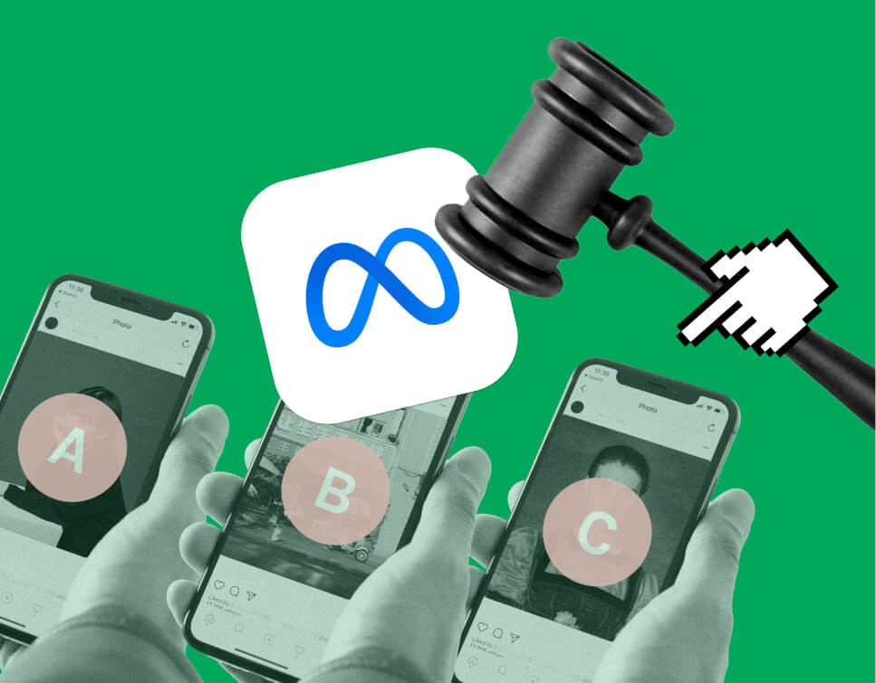
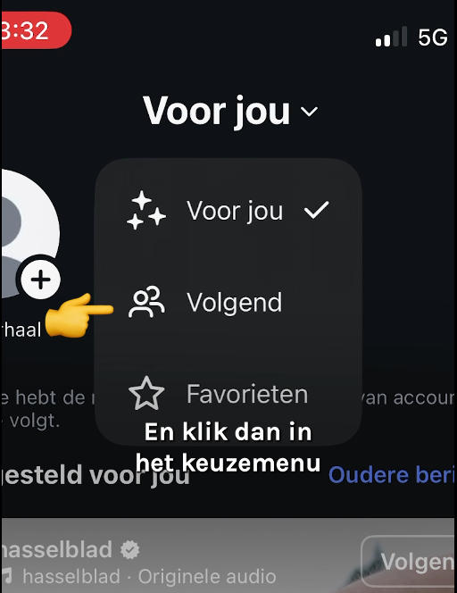

Il y a un moment que je n'ai pas parlé de réseaux sociaux sur ce blog et c'est vraisemblablement parce que je ne les fréquente plus, ils ont mal tourné. Le nombre d'articles décrivant leurs agissements néfastes depuis les révélations de [Frances haugen](https://fr.wikipedia.org/wiki/Frances_Haugen) ne manquent pas. Je n'ai guère besoin d'en rajouter.

## Protéger les mineurs…

Face aux méfaits qui perdurent et qui causent des problèmes de santé mentale (addiction, désinformation, cyberharcèlement, anxiété, dépression…), la France a réagi en proposant l'interdiction des réseaux sociaux aux moins de 15 ans. La proposition de loi a été adoptée fin janvier à l'assemblée nationale à une large majorité et semble faire consensus partout. Déjà, la Tchéquie envisage une loi similaire et des voix commencent à proposer cette solution au niveau européen.

Tout va bien, les enfants vont être protégés et l'on peut s'arrêter là.

<!--excerpt-->

Heu non ! C'est oublier un peu vite que cette solution impose un contrôle d'identité à toutes la population voulant utiliser les réseaux sociaux, à une époque où les vols de données font l'actualité [tous les jours](https://bonjourlafuite.eu.org/). Ceci ne résoud pas la cause du problème, les algorythmes opaques et adictifs des plateformes de média sociaux qui sont aussi la cause de problèmes chez les adultes.

## Appliquer la loi

Une approche plus efficace serait de contraindre les plateformes à être plus transparentes sur leurs algorythmes. C'est justement le but du réglement européen [Digital Services Act](https://eur-lex.europa.eu/legal-content/FR/TXT/?uri=CELEX:32022R2065) qui a été adopté en 2022. Jusqu'à présent, les audits européens réalisés se heurtent à une mauvaise volonté des grosses plateformes et à une complexité technique probablement maintenue pour protéger l'opacité.

Les États pourraient se servir de ce règlement pour infléchir ou sanctionner les Big Tech, mais cette approche les expose à une confrontation directe et usante avec une industrie qui a montré qu’elle ne lâche jamais une source de revenus. De plus, dans la période actuelle, une confrontation directe avec un secteur clé de l’économie des États-Unis expose le politicien tranquille à des risques imprévus. Bref, rien n’est fait pour obliger les plateformes à changer leurs pratiques.

## L'initiative de Bits of Freedom

Si rien n'est fait du côté des exécutifs, il y a une initiative qui est à souligner. Celle de Bits of Freedom qui a attaqué Meta, la maison mère de Facebook et Instagram pour que ces services offrent à leurs utilisateurs la possibilité de choisir un flux de nouvelles non basé sur le profilage algorithmique, uniquement chronologique. cette disposition figure clairement dans le DSA qui s'applique depuis le 17 février 2024.

{.center}

Bits of Freedom est une association spécialisée dans la défense des droits numériques aux Pays-Bas. Elle est connue pour son engagement dans la protection des données personnelles. Avec ce procès contre Instagram et Facebook, elle défend la liberté de choix des utilisateurs et reste pleinement dans son rôle.

L’affaire a commencé à l'été 2025, quand l’association a envoyé sa demande à Meta. Après plusieurs échanges, une discussion entre Meta et l'association s’est tenue le 20 août 2025 et cette dernière n'a pas donné satisfaction. Bits of Freedom a donc transmis sa demande à la justice qui a entendu les plaignants le 22 septembre. [Le jugement](https://www.bitsoffreedom.nl/wp-content/uploads/2025/10/20251002-vonnis-kort-geding.pdf) a été rendu le 2 octobre. Le juge a ordonné à l’entreprise de modifier ses applications sous deux semaines, afin que le choix de l’utilisateur — entre une timeline algorithmique et une timeline chronologique — soit respecté et mémorisé, même après une réouverture de l’application.

Dans un monde normal, devant cet aveu flagrant de non-respect de la loi, l'entreprise s'exécute et l'article peut s'arrêter là. Mais c'est sans compter sur la filouterie des Big Tech qui ont les moyens d'user leurs opposants juste pour gagner un peu de temps. L’histoire est loin d’être terminée.

## Meta gagne du temps

Deux semaines plus tard, Meta n’a toujours pas appliqué les changements. Pire, le 22 octobre, l’entreprise demande un report jusqu’au 31 janvier 2026, arguant de contraintes techniques. Une demande qui indigne Bits of Freedom dont la directrice, Evelyn Austin, [souligne la mauvaise foi](https://www.bitsoffreedom.nl/2025/10/22/meta-voldoet-niet-aan-bevel-rechter-ontloopt-verantwoordelijkheid/)

> "De wetgever wil het, deskundigen zeggen dat het kan en de rechter zegt dat het moet. Toch laat Meta het na haar platformen in lijn te brengen met onze wetgeving. Het is een schoffering van onze democratische rechtsstaat en de rechtspraak. Schandalig, maar helaas niet anders dan we van Meta gewend zijn. We zijn blij dat de rechter op heel korte termijn tijd heeft vrijgemaakt. Gebruikers moeten weten waar ze aan toe zijn," aldus Evelyn Austin, algemeen directeur van Bits of Freedom.

En résumé, les experts disent que c’est possible, le juge ordonne, et Meta persiste à ignorer ses obligations. C’est un mépris total pour notre État de droit.

Le report est accordé par le juge mais seulement jusqu’au 31 décembre 2025 — soit un mois de moins que  le délai demandé par Meta. Le tribunal souligne que « Les adaptations doivent être mises en œuvre le plus rapidement possible, et de manière structurelle ».

## Un changement pour 2026

Dès le 1er janvier 2026, les utilisateurs néerlandais découvrent enfin un changement majeur dans leur interface Facebook et Instagram : ils peuvent choisir entre la timeline algorithmique *voor jouw* (« **Pour toi** ») et une timeline chronologique *Volgend* (« **Suivis** ») — et ce choix est enregistré, même après une fermeture de l’application.

{.center}
*Extrait de [la vidéo](https://www.bitsoffreedom.nl/wp-content/uploads/2026/01/META-VOLGEND-FEED-HOW-TO.mp4) annonçant la nouvelle*{.center}

Le choix Volgend permet de n'afficher que les posts des personnes et groupes suivis de manière chronologique et sans autre ajout. Bits of Freedom s'en réjouit dans [un post du 13 janvier](https://www.bitsoffreedom.nl/2026/01/13/eindelijk-weer-wat-te-kiezen-op-instagram-en-facebook/) (bonne année !) en ajoutant que cela offre un flux sans *endless scroll*, *rabbit hole* ni *time drain*.

> Geen *endless scroll*. Geen *rabbit hole*. Geen *time drain*. Kortom: meer grip op waar je aandacht heen gaat.

Certains de ces termes sont nouveaux pour moi, qui connais pourtant le doomscrolling, mais en gros, les utilisateurs qui font le bon choix ne seront plus pris dans une spirale de contenu dans laquelle ils sont entraînés, souvent de manière involontaire, par des recommandations algorithmiques toujours plus ciblées et addictives. Cette spirale infinie aspire leur temps et leur énergie.

## Et ailleurs en Europe ?

Bien que ce choix soit maintenant en place pour les utilisateurs paysbasiens, je n'ai pas réussi à le retrouver dans mes réglages personnels sur Facebook. Pourtant, je suis citoyen européen et ce DSA est un règlement auquel Facebook doit se conformer dans tous les pays de l'Union depuis presque 2 ans.

Pour reprendre ma comparaison des nouvelles années de 2008, je dirais que :

<table border="0" cellpadding="5">

<tr><td colspan="2"><h2>
Réseaux sociaux
</h2></td></tr>

<tr><td width="50%" valign="top"><h3>En France</h3>
En France, **Facebook** entraîne toujours ses utilisateurs dans une spirale de contenu **addictif**, qui provoque **addiction**, désinformation et autres troubles. Mais rassurez-vous : on va demander aux gens leur âge pour priver les enfants de ces méfaits.

</td><td valign="top"><h3>Aux Pays-Bas</h3>
Enfin, il est possible d’utiliser **Facebook** comme avant : en restant connecté avec nos proches et en partageant nos expériences, sans y perdre trop de temps.

</td></tr>
</table>

## Et ailleurs en Europe ?

Faudra-t-il que d'autres associations attaquent Meta dans les autres pays européens ? Au vu de l'attitude peu enthousiaste de cette entreprise à respecter la loi, j'en ai bien peur.

Pour le moment, il faut attendre parce que le jugement néerlandais ne peut pas encore faire jurisprudence comme le rappelle sur son site Bits of Freedomn [en faisant le point](https://www.bitsoffreedom.nl/2026/02/11/waar-staan-we-met-ons-juridische-gevecht-voor-jouw-keuzevrijheid-in-metas-apps/) le 11 février.

En octobre, Meta a fait appel de la décision, qu’elle doit néanmoins exécuter avant même de connaître le verdict de cet appel. L’audience en appel a eu lieu le 28 janvier dernier. Bien que l’entreprise ait indiqué vouloir contester la décision de justice sur le fond, elle s’est contentée d’accepter le principe selon lequel elle devait respecter le DSA. Elle a également interrogé la cour sur la filiale de Meta juridiquement responsable de ces manquements, ainsi que sur le caractère urgent de la décision.

Le jugement en appel sera rendu le 4 avril. L’affaire n’est donc pas terminée.

