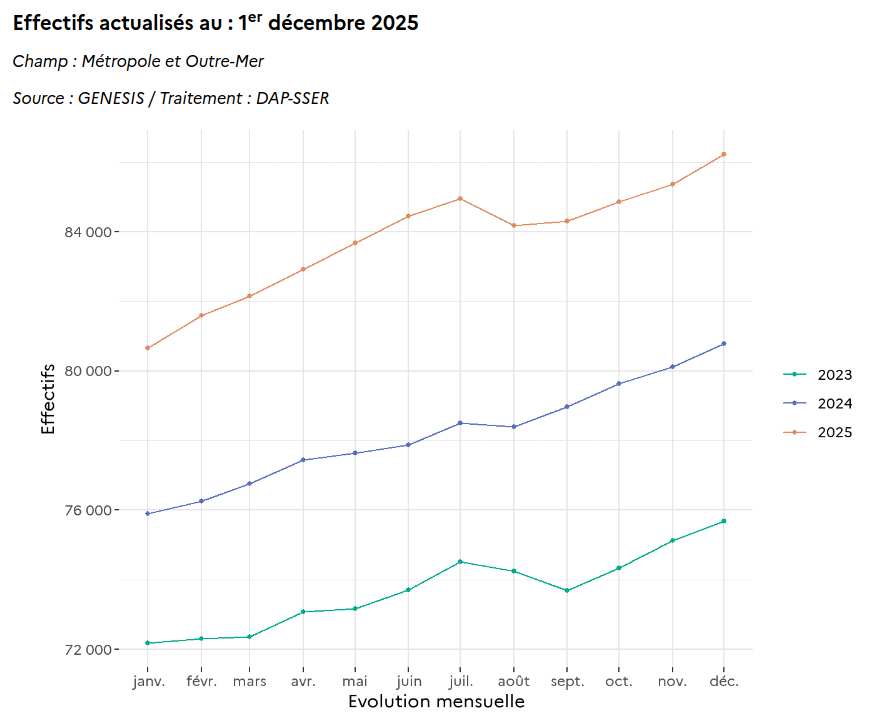

**L’actualité de ce début d'année s'est attardé sur un détenu célèbre dont la peine de prison ferme a été aménagée. Le multi-condamné, ancien Président, a été autorisé à purger sa peine à domicile sous bracelet électronique. Cet aménagement de peine a suscité des débats sur l’égalité devant la justice et les privilèges des personnalités publiques. **

L'aménagement des peines pour éviter l'incarcération n'est pourtant pas une mauvaise idée pour éviter la surpopulation des prisons qui coûte cher à la justice. Seulement le cas médiatique de l'année semble être une exception. La population carcérale française ne cesse d’augmenter, entraînant une surpopulation chronique dans les prisons.

{.center}
__Extrait du rapport [Statistique des établissements et des
personnes écrouées en France](https://www.justice.gouv.fr/sites/default/files/2025-12/statistique_etablissements_personnes_ecrouees_01122025.pdf) par le ministère de la justice__{.center}

En France, les établissements pénitentiaires sont régulièrement pointés du doigt pour leurs conditions de détention difficiles, liées à un taux d’incarcération élevé. À l’inverse, les Pays-Bas suivent une évolution radicalement différente. Il y a quelques années plusieurs prisons fermaient faute de détenus. Un contraste frappant, qui interroge sur les différences de politiques pénales et de cultures juridiques entre les deux pays.

## Nombre de détenus et taux de détention

Alors la France est plus peuplée que les Pays-Bas et il est donc normal qu'il y ait plus de détenues dans le pays le plus grand. Sur [la page Wikipédia](https://fr.wikipedia.org/wiki/Liste_des_pays_par_population_carc%C3%A9rale) qui classe les pays par population carcérale, les États-Unis, la Chine, le Brésil et l'Inde, pays plus peuplés du globe, forment le groupe de tête[^1]. Le nombre de détenus n'est donc pas une donnée de comparaison valable. C'est pourquoi, il est possible de regarder le taux de détention, c'est à dire le nombre de détenus pour 100 000 habitants. La page Wikipédia affiche cette donnée et on constate que la France est dans le millieu du tableau avec 126 détenus tandis que les Pays-Bas affiche meilleur taux à 64 détenus pour 100.000 habitants.

Cette divergence s’inscrit dans une tendance de long terme. Les Pays-Bas ont progressivement réduit leur population carcérale, au point de devoir [fermer des prisons](/pays-bas-ferment-prison/). À l’inverse, la France fait face à une hausse continue du nombre de détenus, avec des prisons souvent saturées à plus de 120 % de leur capacité.

La différence s'explique par une volonté politique de la justice néerladaise à privilégier des peines de plus courte durée et à éviter l'enfermement des condamnées autant que possible. Un article du magasine le Cri explique que cette volonté pourait s'expliquer par la culture religieuse du pays.

## La média le Cri

Lancé récemment, **Le Cri** est un mensuel français ( chrétien joyeux et radical ) qui se propose d’éclairer l’actualité à travers le prisme de la foi chrétienne, sans tomber dans le dogmatisme. Il est porté par une équipe de journalistes aggacés par le recours caricatural des médias d'extrème droite à la tradition catholique. Cette nouvelle équipe s'attache à commenter l'actualité en s’appuyant sur les traditions protestantes et catholiques, tout en ouvrant le dialogue avec d’autres courants de pensée. Le magasine est au format papier ce qui n'empèche pas la rédaction de le rendre présent sur les réseaux sociaux et sur le web.

{.center}

Un article du Cri sous forme de question qui a provoqué l'écriture de [cet article](https://lecri.media/pourquoi-les-protestants-mettent-ils-moins-en-prison-que-les-catholiques/) : **Pourquoi les protestants mettent-ils moins en prison que les catholiques ?** Dans cet article, le théologien Frédéric Rognon, suggère que les différences entre protestants et catholiques pourraient jouer un rôle. 

Historiquement, les pays de tradition protestante, comme les Pays-Bas, ont développé une vision de la justice axée sur la réhabilitation et la réparation, plutôt que sur la punition. À l’inverse, les pays de tradition catholique, comme la France, ont souvent privilégié une approche plus répressive, héritée d’une conception de la justice comme expiation des fautes. Cette hypothèse, développée dans l'article, offre une clé de lecture culturelle à ces divergences.

Frédéric Rognon cite surtout les pays scandinaves qui, comme les Pays-Bas, conçoivent également plus d’alternatives à la prison, comme l’incarcération en milieu ouvert. La France, bien que développant aussi ces alternatives, reste culturellement attachée à l’incarcération comme réponse principale à la délinquance. Cette différence se reflète dans les taux de récidive. Les Pays-Bas, avec leur approche centrée sur la réinsertion, enregistrent des taux de récidive inférieurs à ceux de la France. Un argument de plus pour ceux qui défendent un modèle plus humain et moins coercitif.

## Les calvinistes des Pays-Bas

Dans mon article [Catholiques et protestants](/catholiques-et-protestants/), je nottais déjà cette différence culturelle qu'on pouvait observer dans la vie de tous les jours comme [l'absence de rideaux aux fenêtres](/venez-voir-chez-moi/). Frédéric Rognon explique que pour les protestants, la souffrance est d’une certaine façon absurde. *Elle n’a pas de valeur en soi*. À Amsterdam, j'ai quand même observé un rapport tout calviniste à la souffrance. Tout comme la richesse, la souffrance est un marqueur de style de vie. Il faut l'endurer si elle se préseente. C'est ce qui explique que les médecins qui sortent souvent de la fac de médecine de *Vrije Universiteit Amsterdam* (fac protestante) ne prescrivent que du paracetamol quelquesoit les souffrances de leurs patients.

Heureusement, accepter la souffrance ne signifie pas qu'il faille l'imposer aux autres. 

-----

[^1]: Les chiffres de la page wikipédia, au moment de l'écriture sont de 2024.