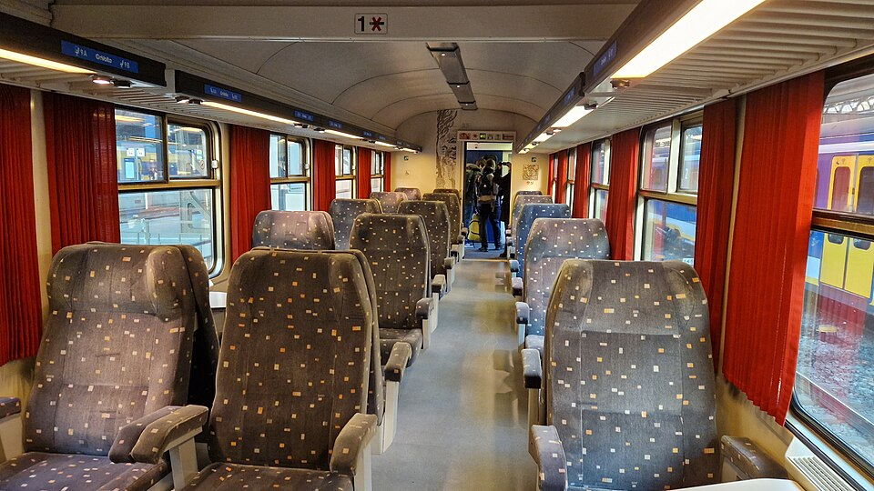
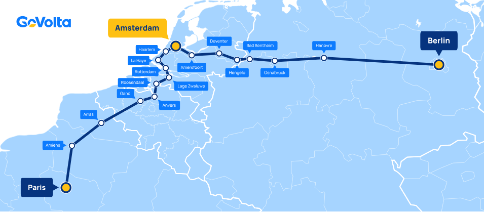

Mes [trajets internationnaux en train](/tag/train/) ont fait les beaux jours de ce blog. J'ai même [dernièrement parlé](/Amsterdam-Prague-en-train-de-nuit/) d’**European Sleeper** et de ses trains de nuit entre Bruxelles, Berlin et Prague. Depuis la coopérative ferroviaire a même relancé la ligne **Paris-Berlin**, comblant le vide laissé par l’arrêt des Nightjet d’ÖBB fin 2025 dans [des circonstances pas claires](https://mathilde-ollivier.fr/trains-de-nuit/remedier-au-manque-de-concertation-sur-le-devenir-des-lignes-de-trains-de-nuit-paris-vienne-et-paris-berlin).

Cette année une nouvelle startup ferroviaire s'attaque à un nouveau marché les liaisons internationales de jour mais à pas cher. C'est [Go Volta](https://govolta.nl/) qui a lancé ses premiers trains en mars 2026 avec des billets à partir de 10 € pour relier Amsterdam à Berlin et Hambourg. Un prix tient tête aux compagnie aériennes low cost et même à la voiture. Pour pouvoir proposer son offre Go Volta n'offre pas de luxe, pas de grande vitesse, pas de wifi, mais un siège garanti, des trajets directs qu'on peut réserver un an à l'avance.

{.center}
> Photo de la livrée bleue Go Volta à quai à Hambourg. photo: Bvcmz248.5{.center}

Le 19 mars dernier, le premier train Go Volta quittait Amsterdam Centraal pour Berlin Gesundbrunnen. Le lendemain, partait un deuxième train vers Hambourg. Le service s'est lancé avec trois allers-retours par semaine pour chaque destination, avec des arrêts à Amersfoort, Deventer, Hengelo, puis Bad Bentheim à la frontière allemande, Osnabrück ainsi qu'Hanovre sur la ligne de Berlin et Brême sur celle d'Hambourg.

<!--
https://mobilithib.substack.com/p/govolta-se-lance-en-voitures-i10

 https://www.euronews.com/travel/2026/03/20/this-dutch-train-startup-is-launching-with-10-tickets-from-amsterdam-to-berlin 
-->

### Des vieux wagons qui roulent toujours

Pour assurer le service Go Volta compte sur ses voitures i10 rachetées en Belgique à la SNCB, rénovées et adaptées pour le long trajet offrant 820 places par train dont 132 en classe Confort. Pour la traction, Go Volta a d’abord envisagé un partenariat avec **Keolis Nederland**, mais les négociations ont échoué au dernier moment. C’est donc **Train Charter Services (TCS)**, une entreprise néerlandaise, qui opère les trains, avec des locomotives Vectron louées à **Railpool** et des Class 101 et 1700 achetées à SNCB.

{.center}
> Intérieur d'un Wagon type i10 en class Comfort photo: AarClaij{.center}

Avec un prix d'entrée à 10€ (en nombre limité) et un prix du billet moyen à 30€ Go Volta offre une alternative abordable et directe aux ICE allemands ou aux Thalys. À ce prix là les voitures n'ont pas de climatisation ni de wifi et sont plutôt viellottes avec parfois des prises électriques sans courant mais les voitures sont propres. Ce train dont la vitesse maximale est de 160 km/h relie les deux capitales en 6h30 ce qui est à peine plus que les ICE avec ses 5h45 quand ils sont à l'heure (ce qui est plutôt rare). 

Comme pour les compagnies aériennes, la politique de prix agressive se double de la vente d'options qui font grimper le prix rapidement. Le choix du siège, une grosse valise, une date de voyage flexible et le prix du billet peut rapidement doubler ou tripler. Malgré cela l'offre reste quand même compétitive.

### Hambourg abandonnée, Berlin renforcée, prochain arrêt à Paris

Après seulement deux mois d’exploitation, Go Volta a annoncé la fin de la ligne Amsterdam-Hambourg pour fin mai 2026. La compagnie startup explique que cette liaison était une idée de Kreolis qui opérait délà sur Hambourg mais le taux de remplissage inférieur à la ligne de Berlin (60 % en moyenne, contre 90 % sur Berlin) est une explication plus compréhensibles de cette décision brutale. Les rames libérées seront redéployées sur Amsterdam-Berlin, qui passera à 6 allers-retours par semaine dès juillet 2026 sans investissement matériel supplémentaire.

<!-- 
https://www.railjournal.com/passenger/main-line/govolta-ends-hamburg-service/

https://govolta.nl/nl/paris 
-->

Ce développement n'est pas la seule annonce. Décembre 2026 verra le lancement de la ligne la plus attendue : Amsterdam-Paris, avec un arrêt à Amiens et Arras puis Gand et Anvers. La ligne n'épouse pas le trajet su Thalys puisque les trains n'ont aucun intéret à emprunter un sillon de LGV Go Volta desservira Gand et Anvers mais ne passera pas par Bruxelles.

{.center}

Ce tracé alternatif coupant court en Belgique me fait rêver à une autre ligne qui reliait Paris à Amsterdam en coupant court en France via Saint-Quentin. c'était l'[Étoile du Nord](https://en.wikipedia.org/wiki/%C3%89toile_du_Nord_(train)), le mythique train de luxe qui reliait Paris à Amsterdam via Bruxelles dès les années 1920, avant de rejoindre le réseau **Trans-Europ-Express** (TEE) dans les années 1950. À l’époque, le trajet durait 8 heures dans des wagons Pullman mais il y a même eu une ligne de nuit qui mettait 10h mais faisait arriver les voyageurs frais le matin. Une option que j'aurais aimé connaître…

Les horaires précis à chaque arrêt ne sont pas encore connus mais le train devrait mettre 7 heures à relier Paris à la capitale batave ce qui ne fait qu'une heure de moins que le Thalys pour un coût qui prommet dêtre bien moindre. Les détails seront connus avant le premier départ le 14 décembre mais [les billets sont déjà en vente](https://govolta.nl/nl/package/paris).
<!--
https://govolta.nl/nl/package/paris

-->
### L'avenir

La compagnie communique beaucoup sur son avenir puisqu'elle envisage dont continuer à développer son offre de voyage en train internationnaux d'entrée de game sur d'autres destinations comme Munich ou Bâle. Mais avant que ces annonces se concrétisent il faudra que les deux premières lignes entre Amsterdam, Paris et Berlin fassent la preuve de leur rentabilité. Rendez-vous donc dans quelques années pour faire le point. Et dans quelques mois sur un siège dans un wagono i10.

<!---
https://mediarail.wordpress.com/2025/01/06/rail-europe-news-les-breves-de-lactu-ferroviaire/
----->